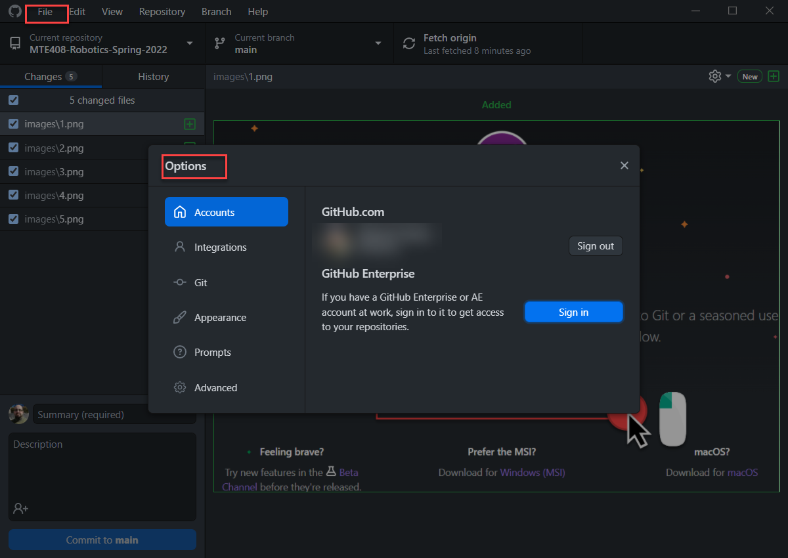
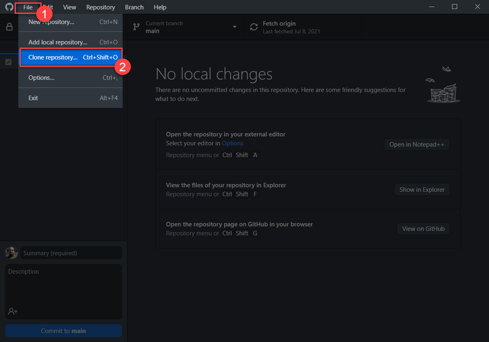
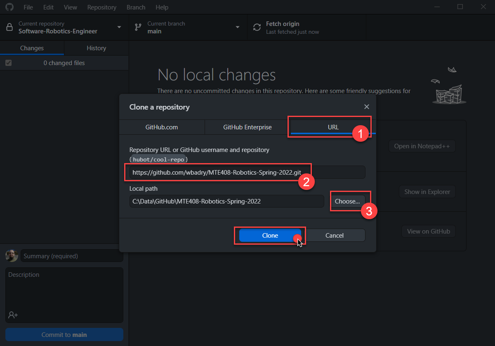
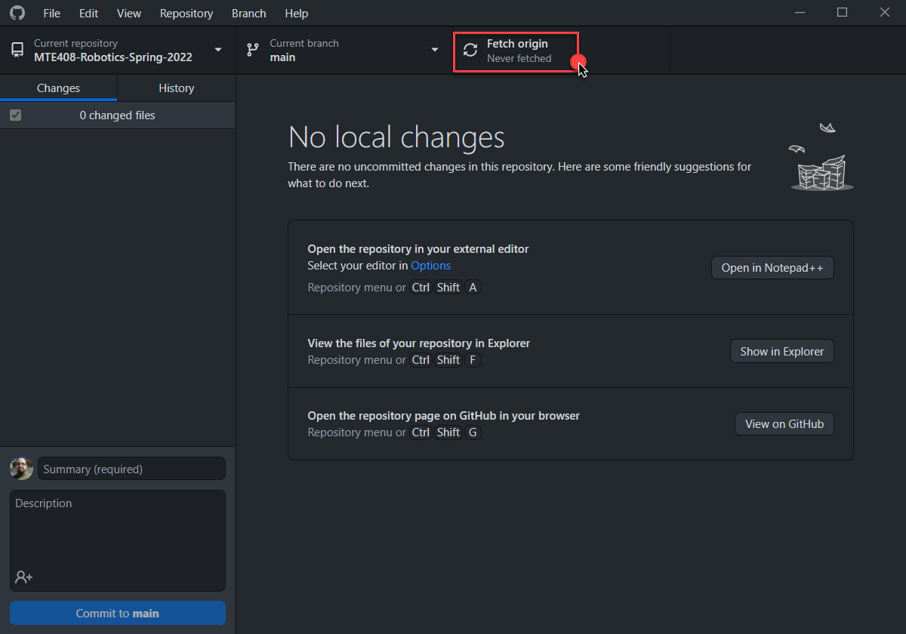
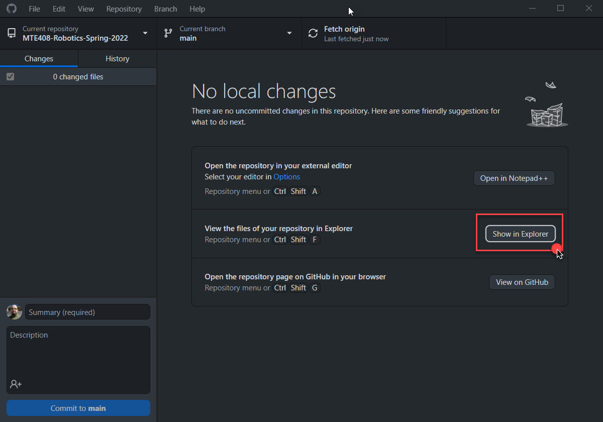
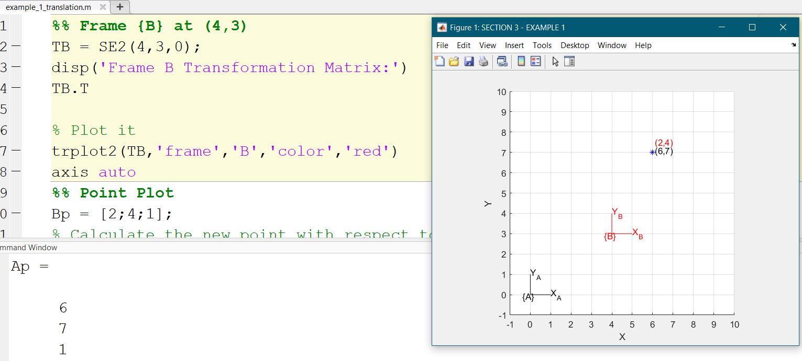
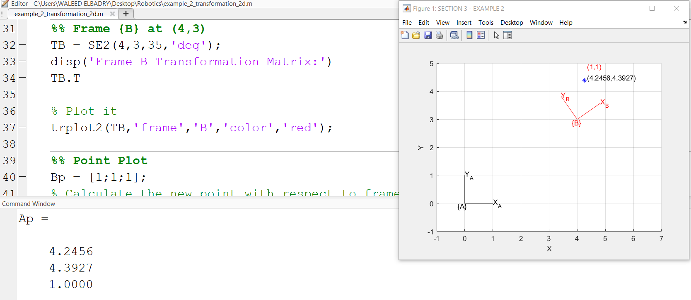
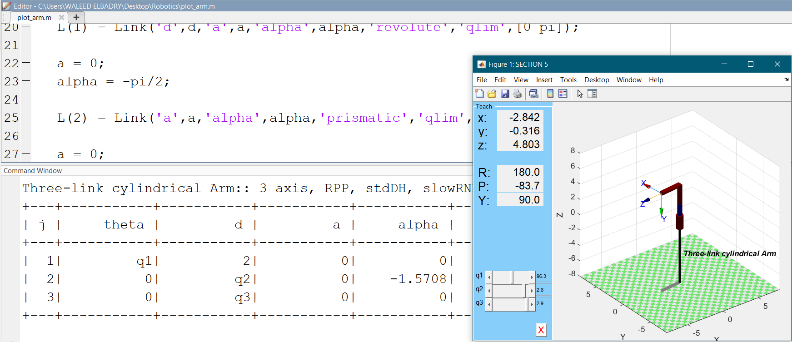
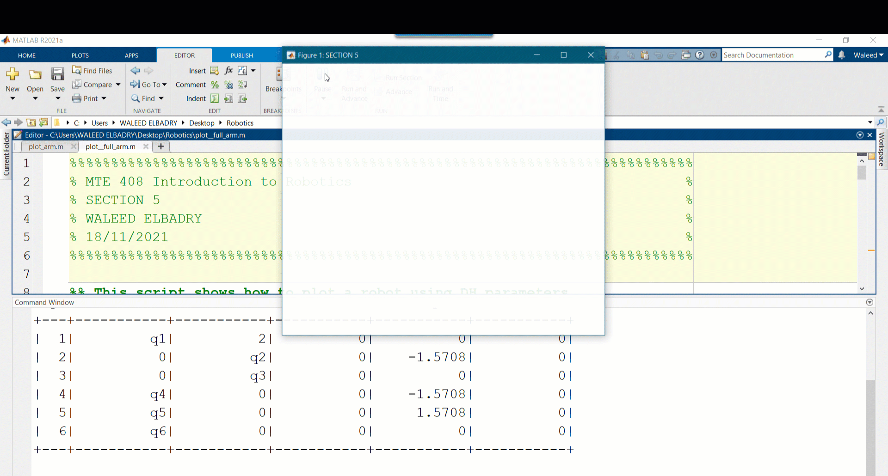

# MTE408-Robotics-Spring-2022

Greetings students of this semster :wave:

This a repository with all of the lab presentations and exercises.

### How to get the contents of the course

- Download Github for desktop from [here](https://desktop.github.com/)
  

- Create an account for you on Github : https://github.com/
- Sign in with your account to Github desktop from `file -> options`

- Clone the course repository from ` file -> clone repository`

- Select `URL` tab and copy the course repository URL : https://github.com/wbadry/MTE408-Robotics-Spring-2022.git
- Select the location you wish to have the course repository.
- When all is set, click on `clone`

- To get the update of the course content, click on `fetch origin`

- The Cloned respository can be accessed using `show in explorer`

# LABS

**LAB1** : Review on Matrices and MATLAB implementation 
--------------------------------------------------------

**LAB2** : Exercises on Matrices
--------------------------------------------------------

**LAB3** : 2D homogeneous transformation
--------------------------------------------------------

**LAB4** : 3D homogeneous transformation
--------------------------------------------------------

**LAB5** : Debavit Hartenberg (DH) parameters
--------------------------------------------------------

**Quiz1** : 3D homogeneous transformation quiz
--------------------------------------------------------

**LAB6** : Inverese Kinematics for cartesian robot
--------------------------------------------------------

**LAB7** : Inverese Kinematics for articulated arm
--------------------------------------------------------

**LAB8** : Jacobian Matrix for Cartesian arm
--------------------------------------------------------

**LAB9** : Jacobian Matrix for Articulated arm
--------------------------------------------------------

**LAB10** : Trajectory Generation
--------------------------------------------------------

**LAB11** : Motor Sizing using Visual Sizer Pro
--------------------------------------------------------

**LAB12** : Motor Sizing with Gear Inertia using SolidWORKS
--------------------------------------------------------

 
# MATLAB EXERCISES

 

 

 

 
# VISUAL SIZER

